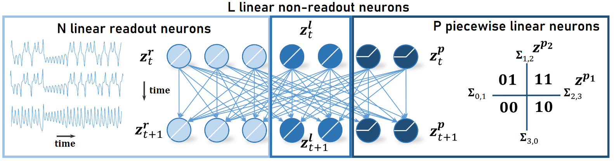

# Almost-Linear RNNs Yield Highly Interpretable Symbolic Codes in DSR

# Introduction
This repository provides an implementation of the Almost-Linear RNN (AL-RNN) used for dynamical systems (DS) reconstruction and time series forecasting. 



The AL-RNN automatically and robustly generates piecewise linear representations of DS from time series data and inherently provide a symbolic encoding of the underlying DS, while preserving key topological properties. The AL-RNNs are trained using backpropagation through time with a sparse teacher forcing protocol.

The implentation of the ALRNN is available in Julia and Python.

# 1. Julia implementation
To install the package, clone the repostiory and `cd` into the project folder:
Install the package in a new Julia environment:
```
julia> ]
(@v1.10) pkg> activate .
pkg> instantiate
```

## Running the Code
### Single Runs
To start a single training, execute the `main.jl` file, where arguments can be passed via command line. For example, to train a ALRNN with 20 latent dimensions and 2 PWL units for 2000 epochs using 4 threads, while keeping all other training parameters at their default setting, call
```
$ julia -t4 --project main.jl --model ALRNN --latent_dim 20 --P 2 --epochs 2000
```
in your terminal of choice (bash/cmd). The [default settings](settings/defaults.json) can also be adjusted directly; one can then omit passing any arguments at the call site. The arguments are also listed in  in the [`argtable()`](src/parsing.jl) function.

### Multiple Runs + Grid Search
To run multiple trainings in parallel e.g. when grid searching hyperparameters, the `ubermain.jl` file is used. Currently, one has to adjust arguments which are supposed to differ from the [default settings](settings/defaults.json), and arguments that are supposed to be grid searched, in the `ubermain` function itself. This is as simple as adding an `Argument` to the `ArgVec` vector, which is passed the hyperparameter name (e.g. `latent_dim`), the desired value, and and identifier for discernibility and documentation purposes. If value is a vector of values, grid search for these hyperparameters is triggered. 
```Julia
function ubermain(n_runs::Int)
    # load defaults with correct data types
    defaults = parse_args([], argtable())

    # list arguments here
    args = SymbolicDSR.ArgVec([
        Argument("experiment", "ALRNN_Lorenz63"),
        Argument("model", "ALRNN"),
        Argument("pwl_units", [0,1,2,3,4,5], "P"),
    ])

    [...]
end
```
This will run a grid search over `pwl_units` corresponding to the number of PWL units using the `ALRNN`.

The identifier (e.g. `"P"` in the snippet above) is only mandatory for arguments subject to grid search. Once Arguments are specified, call the ubermain file with the desired number of parallel worker proccesses (+ amount of threads per worker) and the number of runs per task/setting, e.g.
```{.sh}
$ julia -t2 --project ubermain.jl -p 20 -r 10
```
will queue 10 runs for each setting and use 20 parallel workers with each 2 threads.

## Evaluating Models
Evaluating trained model can be done via `evaluate.jl`. Here the settings and arguments (specified in [default settings](settings/defaults.json)) need to be provided from a performed experiment (like shown above).

## Specifics

### Model Architecture
Latent/Dynamics model
- ALRNN &rarr; [`ALRNN`](src/models/alrnn.jl), where `pwl_units` controls the number of PWL units
with 
- Identity mapping &rarr; [`Identity`](src/models/identity.jl), to generate observations

### Data Format
Data for the algorithm is expected to be a single trajectory in form of a $T \times N$ matrix (file format: `.npy`), where $T$ is the total number of time steps and $N$ is the data dimensionality. [Examples](example_data/) are provided.

### Training method
The ALRNN is trained by backpropagation through time using sparse teacher forcing. The forcing interval is controlled by `teacher_forcing_interval`, which specifies the intervals at which the latent state is forced according to the observations in order to prevent exploding/vanishing gradients.

# 2. Python Implementation
A basic implementation of the model and training routine is also available in python (see[ALRNN_python](alrnn_python/) folder). 

## Model and Training routine
The model including its training algorithm is implemented in the &rarr; [`ALRNN_Tutorial`](alrnn_python/AL-RNN_tutorial.ipynb) notebook. The AL-RNN using Identity mapping to generate observations is defined within the model class `AL_RNN`. The latent dimension $M$ and number of PWL units $P$ need to be specified. Training is performed through the `training_sh` routine using backpropagation through time with a sparse teacher forcing protocol, forcing the latent states based on the observations in order to prevent exploding/vanishing gradients.

## Dataset
Data for the algorithm is expected to be a single trajectory in form of a $T \times N$ matrix (file format: `.npy`), where $T$ is the total number of time steps and $N$ is the data dimensionality. To generate a dataset for training, the `TimeSeriesDataset` class in the &rarr; [`dataset`](alrnn_python/dataset.py) file can be used.

## Example Models and Evaluation
Trained example models are provided in [ALRNN_models](alrnn_python/models/). They can be evaluated using a simple evaluation provided in the &rarr; [`ALRNN_Tutorial`](alrnn_python/AL-RNN_tutorial.ipynb) notebook. The linear subregion analysis functions are provided in the &rarr; [`dataset`](alrnn_python/linear_region_functions.py) file.


# Acknowledgements
This work was funded by the Federal Ministry of Science, Education, and Culture (MWK) of the state of Baden-Württemberg within the AI Health Innovation Cluster Initiative, by the German Research Foundation (DFG) within Germany’s Excellence Strategy EXC 2181/1 – 390900948 (STRUCTURES), and through DFG individual grant Du 354/15-1 to DD. ZM was funded by the Federal Ministry of Education and Research (BMBF) through project OIDLITDSM, 01IS24061.
